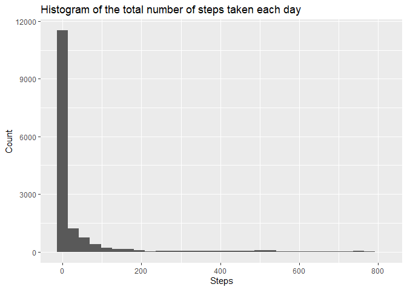
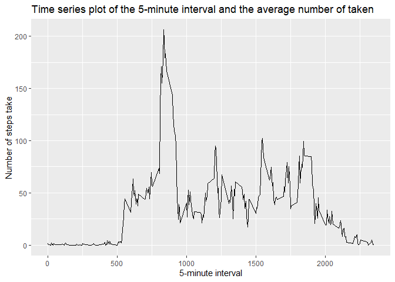
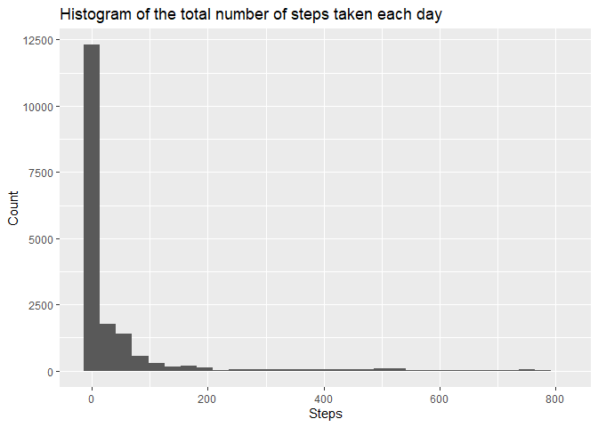
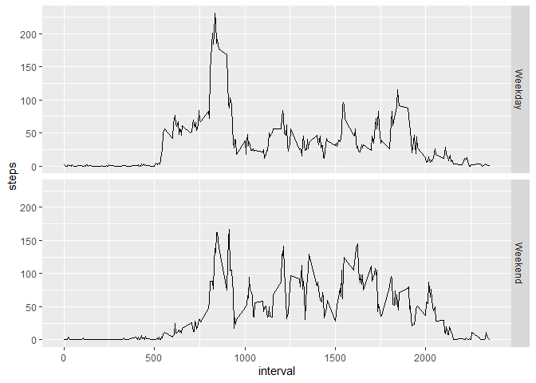

```r
knitr::opts_chunk$set(echo = TRUE)
```


```r
library(readr)
library(ggplot2)
library(dplyr)
```

```
## 
## Attaching package: 'dplyr'
```

```
## The following objects are masked from 'package:stats':
## 
##     filter, lag
```

```
## The following objects are masked from 'package:base':
## 
##     intersect, setdiff, setequal, union
```

## Loading and preprocessing the data


```r
activity = read_csv(unz("activity.zip", "activity.csv"),
                    col_types = cols(steps = col_integer(),
                                     date = col_date(format = "%Y-%m-%d"),
                                     interval = col_integer()))
```

## What is mean total number of steps taken per day?

### Make a histogram of the total number of steps taken each day.

```r
activity %>%
	na.omit() %>%	
	ggplot(aes(steps)) +
	geom_histogram() +
    labs(title = "Histogram of the total number of steps taken each day",
         y = "Count",
         x = "Steps")
```

```
## `stat_bin()` using `bins = 30`. Pick better value with `binwidth`.
```

<!-- -->

### Calculate and report the mean and median total number of steps taken per day.


```r
activity %>%
	na.omit() %>%
	summarize(Mean = mean(steps),
	          Median = median(steps))
```

```
## # A tibble: 1 x 2
##    Mean Median
##   <dbl>  <dbl>
## 1  37.4      0
```

## What is the average daily activity pattern?

### Make a time series plot (i.e. type = "l") of the 5-minute interval (x-axis) and the average number of steps taken, averaged across all days (y-axis)


```r
activity %>%
	na.omit() %>%
	group_by(interval) %>%
	summarize(steps = mean(steps)) %>%
    ungroup() %>%
	ggplot(aes(x = interval, y = steps)) +
	geom_line() +
    labs(title = "Time series plot of the 5-minute interval and the average number of taken",
         x = "5-minute interval",
         y = "Number of steps take")
```

```
## `summarise()` ungrouping output (override with `.groups` argument)
```

<!-- -->

### Which 5-minute interval, on average across all the days in the dataset, contains the maximum number of steps?


```r
activity %>%
	na.omit() %>%
	group_by(interval) %>%
	summarize(steps = mean(steps)) %>%
	ungroup() %>%
	filter(steps == max(steps))
```

```
## `summarise()` ungrouping output (override with `.groups` argument)
```

```
## # A tibble: 1 x 2
##   interval steps
##      <int> <dbl>
## 1      835  206.
```

## Imputing missing values

### Calculate and report the total number of missing values in the dataset (i.e. the total number of rows with NA's)

```r
total.cases = nrow(activity)
complete.cases = sum(complete.cases(activity))
missing.values = total.cases - complete.cases
missing.values
```

```
## [1] 2304
```
### Devise a strategy for filling in all of the missing values in the dataset. The strategy does not need to be sophisticated. For example, you could use the mean/median for that day, or the mean for that 5-minute interval, etc.

```r
mean.steps.per.interval = activity %>%
	na.omit() %>%
	group_by(interval) %>%
	summarize(mean.steps = mean(steps)) %>%
	ungroup()
```

```
## `summarise()` ungrouping output (override with `.groups` argument)
```

```r
mean.steps.per.interval
```

```
## # A tibble: 288 x 2
##    interval mean.steps
##       <int>      <dbl>
##  1        0     1.72  
##  2        5     0.340 
##  3       10     0.132 
##  4       15     0.151 
##  5       20     0.0755
##  6       25     2.09  
##  7       30     0.528 
##  8       35     0.868 
##  9       40     0     
## 10       45     1.47  
## # ... with 278 more rows
```

### Create a new dataset that is equal to the original dataset but with the missing data filled in.

```r
new.activity = activity %>%
	left_join(mean.steps.per.interval, by = "interval") %>%
	mutate(steps = ifelse(is.na(steps),
	                      mean.steps,
	                      steps)) %>%
	select(-mean.steps)
```

### Make a histogram of the total number of steps taken each day and Calculate and report the mean and median total number of steps taken per day.


```r
new.activity %>%
	na.omit() %>%	
	ggplot(aes(steps)) +
	geom_histogram() +
    labs(title = "Histogram of the total number of steps taken each day",
         y = "Count",
         x = "Steps")
```

```
## `stat_bin()` using `bins = 30`. Pick better value with `binwidth`.
```

<!-- -->

```r
new.activity %>%
	na.omit() %>%
	summarize(mean = mean(steps),
		median = median(steps))
```

```
## # A tibble: 1 x 2
##    mean median
##   <dbl>  <dbl>
## 1  37.4      0
```

### Do these values differ from the estimates from the first part of the assignment?
What is the impact of imputing missing data on the estimates of the total daily number of steps?
No, they do not differ from the first part of the assignment.


```r
activity.summary = activity %>%
	na.omit() %>%
	summarize(mean = mean(steps),
	          median = median(steps))
mean.0 = activity.summary[["mean"]]
median.0 = activity.summary[["median"]]

new.activity.summary = new.activity %>%
	na.omit() %>%
	summarize(mean = mean(steps),
	          median = median(steps))
mean.1 = new.activity.summary[["mean"]]
median.1 = new.activity.summary[["median"]]

var.mean = mean.1 - mean.0
var.median = median.1 - median.0
var.mean
```

```
## [1] 0
```

```r
var.median
```

```
## [1] 0
```

## Are there differences in activity patterns between weekdays and weekends?

For this part the weekdays() function may be of some help here. Use the dataset with the filled-in missing values for this part.

### Create a new factor variable in the dataset with two levels -- "weekday" and "weekend" indicating whether a given date is a weekday or weekend day.

```r
new.activity = new.activity %>%
	mutate(weekday = as.factor(ifelse(weekdays(date) == "Saturday" | weekdays(date) == "Sunday",
	                                  "Weekend",
	                                  "Weekday")))
```

### Make a panel plot containing a time series plot (i.e. type = "l") of the 5-minute interval (x-axis) and the average number of steps taken, averaged across all weekday days or weekend days (y-axis).

```r
new.activity %>%
	group_by(interval, weekday) %>%
	summarize(steps = mean(steps)) %>%
	ggplot(aes(x = interval, y = steps)) +
	geom_line() +
    facet_grid(rows = vars(weekday))
```

```
## `summarise()` regrouping output by 'interval' (override with `.groups` argument)
```

<!-- -->
